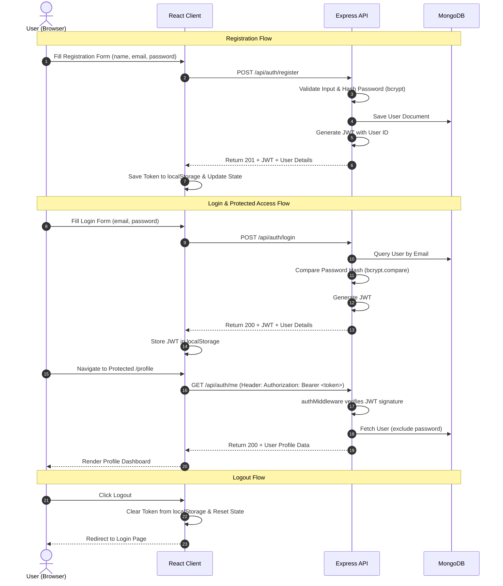

# 🔒 AuthVault

> A clean, beginner-friendly full-stack authentication system built as a portfolio project.

[](https://nodejs.org/)
[](https://expressjs.com/)
[](https://reactjs.org/)
[](https://vitejs.dev/)
[](https://www.mongodb.com/)
[](https://jwt.io/)
[](LICENSE)

---

## 📖 Overview

**AuthVault** is a robust, production-ready, and beginner-friendly full-stack authentication starter kit and portfolio project. It demonstrates modern authentication workflows using JSON Web Tokens (JWT), password hashing with bcrypt, protected routing in React, and scalable REST API patterns in Node.js & Express.

---

## ✨ Features

- **User Registration**: Client-side & server-side validation for name, email, and strong passwords.
- **Secure Authentication**: Stateless session management via JSON Web Tokens (JWT).
- **Password Security**: Salted hashing with `bcryptjs` before persisting to database.
- **Protected Routes**: Frontend route guards and backend middleware restricting access to authorized users.
- **User Profile Dashboard**: Fetch authenticated user profile data dynamically.
- **Modern Dark UI**: Polished glassmorphic dark theme built with modern CSS.
- **Fully Responsive**: Optimized for desktop, tablet, and mobile displays.
- **Error Handling**: Descriptive error messages for duplicate accounts, invalid credentials, and expired tokens.

---

## 🛠 Tech Stack

### Backend
| Technology | Description |
| :--- | :--- |
| **Node.js** | JavaScript runtime environment |
| **Express.js** | Fast, unopinionated web framework for Node.js |
| **MongoDB & Mongoose** | NoSQL database & Object Data Modeling (ODM) library |
| **JSON Web Tokens (`jsonwebtoken`)** | Compact, URL-safe means of representing claims between parties |
| **`bcryptjs`** | Library to hash and salt user passwords securely |
| **`dotenv`** | Module to load environment variables from `.env` |
| **`cors`** | Express middleware to enable Cross-Origin Resource Sharing |

### Frontend
| Technology | Description |
| :--- | :--- |
| **React 18** | Frontend library for building component-based user interfaces |
| **Vite** | Next-generation frontend tooling and fast dev server |
| **React Router v6** | Declarative client-side routing and route protection |
| **Axios** | Promise-based HTTP client with request interceptors |
| **Custom CSS** | Modern dark theme styling with glassmorphism and smooth transitions |

---

## 📁 Project Structure

```
AuthVault/
├── backend/
│   ├── src/
│   │   ├── config/
│   │   │   └── db.js                 # MongoDB connection setup
│   │   ├── controllers/
│   │   │   └── authController.js     # Auth request handlers (register, login, me)
│   │   ├── middleware/
│   │   │   └── authMiddleware.js     # JWT verification middleware
│   │   ├── models/
│   │   │   └── User.js               # Mongoose User schema & password hashing
│   │   ├── routes/
│   │   │   └── authRoutes.js         # API endpoints routing
│   │   ├── utils/
│   │   │   └── generateToken.js      # JWT signing helper
│   │   └── server.js                 # Express app initialization & listener
│   ├── .env.example                  # Template for backend environment variables
│   ├── .gitignore
│   └── package.json
│
├── frontend/
│   ├── public/
│   │   └── vite.svg
│   ├── src/
│   │   ├── assets/                   # Static assets & icons
│   │   ├── components/
│   │   │   ├── Navbar.jsx            # Responsive navigation header
│   │   │   └── ProtectedRoute.jsx    # Route wrapper checking auth state
│   │   ├── context/
│   │   │   └── AuthContext.jsx       # Global authentication state provider
│   │   ├── pages/
│   │   │   ├── Home.jsx              # Landing / Welcome page
│   │   │   ├── Login.jsx             # User login form
│   │   │   ├── Register.jsx          # Registration form
│   │   │   └── Profile.jsx           # Protected user profile dashboard
│   │   ├── services/
│   │   │   └── api.js                # Axios instance & API helper functions
│   │   ├── styles/
│   │   │   └── auth.css              # Glassmorphic dark styling
│   │   ├── App.jsx                   # Route configuration
│   │   ├── main.jsx                  # React application entry point
│   │   └── index.css                 # Global CSS variables & resets
│   ├── .env.example                  # Template for frontend environment variables
│   ├── .gitignore
│   ├── index.html
│   ├── package.json
│   └── vite.config.js
│
└── README.md
```

---

## ⚙️ Environment Setup

### Backend `.env`

Create a `.env` file in the `backend/` directory:

```env
PORT=5000
MONGO_URI=mongodb://127.0.0.1:27017/authvault
JWT_SECRET=your_super_secret_jwt_key_change_in_production
JWT_EXPIRES_IN=7d
```

#### Environment Variables Reference

| Variable | Description | Example |
| :--- | :--- | :--- |
| `PORT` | Port number the Express backend server listens on | `5000` |
| `MONGO_URI` | MongoDB connection string (Local or MongoDB Atlas) | `mongodb://localhost:27017/authvault` |
| `JWT_SECRET` | Secret key used to sign and verify JSON Web Tokens | `your_secret_key_here` |
| `JWT_EXPIRES_IN` | Token expiration timeframe | `7d` or `24h` |

---

## 🚀 Installation & Running

### Prerequisites
- **Node.js** (v18.0.0 or higher)
- **npm** or **yarn**
- **MongoDB** running locally or a **MongoDB Atlas** cloud connection string

---

### 1. Clone the Repository
```bash
git clone https://github.com/your-username/AuthVault.git
cd AuthVault
```

---

### 2. Backend Setup
```bash
cd backend
npm install
cp .env.example .env    # On Windows: copy .env.example .env
npm run dev
```
> The backend server will start on **`http://localhost:5000`**

---

### 3. Frontend Setup
Open a new terminal window:
```bash
cd frontend
npm install
npm run dev
```
> The frontend application will start on **`http://localhost:5173`**

---

## 📡 API Documentation

Base URL: `http://localhost:5000/api/auth`

### Endpoints Overview

| Method | Endpoint | Description | Auth Required |
| :--- | :--- | :--- | :--- |
| `POST` | `/api/auth/register` | Register a new user account | ❌ No |
| `POST` | `/api/auth/login` | Authenticate user & return JWT token | ❌ No |
| `GET` | `/api/auth/me` | Retrieve authenticated user profile | ✅ Yes (`Bearer <token>`) |

---

### 1. Register User

- **Endpoint**: `POST /api/auth/register`
- **Headers**: `Content-Type: application/json`
- **Request Body**:
```json
{
  "name": "Alex Mercer",
  "email": "alex@example.com",
  "password": "Password123!",
  "confirmPassword": "Password123!"
}
```

- **Success Response (`201 Created`)**:
```json
{
  "success": true,
  "message": "User registered successfully",
  "token": "eyJhbGciOiJIUzI1NiIsInR5cCI6IkpXVCJ9...",
  "user": {
    "id": "664b38d6f9a5e123456789ab",
    "name": "Alex Mercer",
    "email": "alex@example.com",
    "createdAt": "2026-08-19T11:00:00.000Z"
  }
}
```

- **Error Responses**:
  - `400 Bad Request`: Missing fields or passwords do not match.
  - `409 Conflict`: An account with that email address already exists.

---

### 2. Login User

- **Endpoint**: `POST /api/auth/login`
- **Headers**: `Content-Type: application/json`
- **Request Body**:
```json
{
  "email": "alex@example.com",
  "password": "Password123!"
}
```

- **Success Response (`200 OK`)**:
```json
{
  "success": true,
  "message": "Login successful",
  "token": "eyJhbGciOiJIUzI1NiIsInR5cCI6IkpXVCJ9...",
  "user": {
    "id": "664b38d6f9a5e123456789ab",
    "name": "Alex Mercer",
    "email": "alex@example.com"
  }
}
```

- **Error Responses**:
  - `400 Bad Request`: Email and password are required.
  - `401 Unauthorized`: Invalid email or password.

---

### 3. Get User Profile

- **Endpoint**: `GET /api/auth/me`
- **Headers**: `Authorization: Bearer <token>`

- **Success Response (`200 OK`)**:
```json
{
  "success": true,
  "user": {
    "id": "664b38d6f9a5e123456789ab",
    "name": "Alex Mercer",
    "email": "alex@example.com",
    "createdAt": "2026-08-19T11:00:00.000Z"
  }
}
```

- **Error Responses**:
  - `401 Unauthorized`: Missing, invalid, or expired authorization token.

---

## 🔐 Authentication Flow

The authentication architecture is stateless and secured with JSON Web Tokens (JWT) and salted bcrypt password hashing:



### Key Steps in the Auth Life Cycle:
1. **Registration**: The user submits registration details. Passwords are salted and hashed using `bcryptjs` before being stored in MongoDB.
2. **Login & Token Generation**: On successful credential verification, the backend issues a signed JWT containing the user's ID as the payload.
3. **Client Persistence**: The React frontend persists the JWT in `localStorage` and updates the React `AuthContext`.
4. **Authorized Requests**: For protected endpoints, Axios automatically attaches the token in the `Authorization: Bearer <token>` header.
5. **Backend Verification**: The `authMiddleware` validates the token's cryptographic signature and attaches the authenticated user record to the request.
6. **Logout**: The client clears the JWT from `localStorage` and resets the global auth state, instantly revoking frontend access.

---

## 🧪 Testing with Postman / cURL

### 1. Register a User
```bash
curl -X POST http://localhost:5000/api/auth/register \
  -H "Content-Type: application/json" \
  -d '{
    "name": "Alex Mercer",
    "email": "alex@example.com",
    "password": "Password123!",
    "confirmPassword": "Password123!"
  }'
```

### 2. Login User
```bash
curl -X POST http://localhost:5000/api/auth/login \
  -H "Content-Type: application/json" \
  -d '{
    "email": "alex@example.com",
    "password": "Password123!"
  }'
```

### 3. Fetch Protected Profile
```bash
curl -X GET http://localhost:5000/api/auth/me \
  -H "Authorization: Bearer YOUR_JWT_TOKEN_HERE"
```

---

## 📸 Screenshots

> *Screenshots coming soon*

| Login Screen | Profile Dashboard |
| :---: | :---: |
| *(Screenshots coming soon)* | *(Screenshots coming soon)* |

---

## 🔮 Future Improvements

- [ ] **Refresh Tokens**: Implement rotating refresh tokens in HTTP-only cookies for enhanced token lifecycle security.
- [ ] **Email Verification**: Send account activation links with Nodemailer or SendGrid upon registration.
- [ ] **Password Reset**: Secure forgot-password flow with time-limited reset tokens.
- [ ] **OAuth 2.0 Integration**: Social login with Google, GitHub, and Discord.
- [ ] **Rate Limiting**: Protect authentication endpoints against brute-force attacks with `express-rate-limit`.
- [ ] **Input Sanitization**: Enhance validation and sanitation with `express-validator` and `DOMPurify`.
- [ ] **Docker Containerization**: Add `Dockerfile` and `docker-compose.yml` for streamlined containerized development and deployment.

---

## 📄 License

This project is licensed under the **MIT License** - see the [LICENSE](LICENSE) file for details.

---

<div align="center">
  <sub>Built with ❤️ by full-stack developers for full-stack developers.</sub>
</div>
